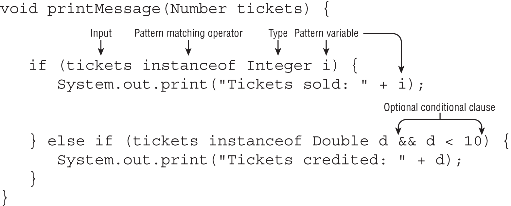

# Pattern Matching

`Pattern Matching` is a technique of controlling program flow
- that only executes a section of code that meets certain criteria

`Pattern Matching` is a useful tool for reducing boilerplate code in applications
- `Boilerplate Code` is code that tends to be duplicated throughout a section of code
    - Over and Over again in a similar manner


## Shortening Code with Pattern Matching

### Pattern Variable

```
void compareIntegers(Number number) {
   if (number instanceof Integer data) {
      System.out.print(data.compareTo(5));
   }
}
```
- The variable `data` in this example is referred to as the pattern variable



```
if (number instanceof final Integer i) {
    return "Integer: " + i;
} else if (number instanceof final Double d && d < 10) {
    return "Small Double: " + d;
} else if (number instanceof final Double d && d >= 10 && d < 100) {
    return "Middle Double: " + d;
} else if (number instanceof final Double d && d > 100) {
    return "Large Double: " + d;
} else if (number instanceof final Object obj) {
    return "A plain Object: " + obj;
}
// else if (number instanceof String s) {} // Doesn't compile
else if (number instanceof final AutoCloseable closeable) {
    // number does not refer to a final class or type, so it does compile
    return null;
} else {
    return "Null Number";
}
```

- The anatomy of pattern matching using the `instanceof` operator and `if` statements
    - Adding a variable after the type is what instructs the compiler to treat it as pattern matching
    - An optional conditional clause, declared as a `boolean` expression
      - to filter data out
- Reassigning Pattern Variables is a BAD Idea
  - The reassignment can be prevented with a `final` modifier
- `Conditional Clause`: `&& d >= 10 && d < 100`
    - `&&` is a `conditional operator`

#### Pattern Matching with `null`
- The `instanceof` operator always evaluates `null` references to `false`
- The same holds for `Pattern Matching`

#### Supported Types
- The type of the pattern variable must be a compatible type
  - including the below of the reference variable
    - the same type   
    - a subtype
    - a supertype
- If the reference variable does not refer to a `final` class or type
  - then it can also include an unrelated interface for reasons

#### Flow Scoping
- The compiler applies flow scoping when working with pattern matching
- Flow scoping means the variable is only in scope when
  - the compiler can definitively determine its type
- Flow scoping is unlike any other type of scoping
  - It is not strictly hierarchical
  - It is determined by the compiler based on the branching and flow of the program
- It is possible to use a Pattern Variable outside the `if` statement
  - but only when the compiler can definitively determine its type

```
void printIntegersOrNumbersGreaterThan5(Number number) {
   // DOES NOT COMPILE
   if (number instanceof Integer data || data.compareTo(5) > 0)
      System.out.print(data);
}
```

```
void printIntegerTwice(Number number) {
   if (number instanceof Integer data)
      System.out.print(data.intValue());
   System.out.print(data.intValue());  // DOES NOT COMPILE
}
```

```
void printOnlyIntegers(Number number) {
   if (!(number instanceof Integer data))
      return;
   System.out.print(data.intValue()); // DOES COMPILE
}
```


## Using Pattern Matching with `switch`

### Data Types Supported by `switch`
- `int` and `Integer`
- `byte` and `Byte`
- `short` and `Short`
- `char` and `Character`
- `String`
- `enum` values
- **All `object` types**
  - when used with Pattern Matching
- `var`
  - if the type resolves to one of the preceding types

### Data Types NOT Supported by `switch`
- `boolean`
- `long`
- `float`
- `double`

> Starting with `Java 21`, `switch` statements and expressions now support `Pattern Matching`
> - which means any object type can now be used as a `switch` variable
>   - provided the `Pattern Matching` is used

### How it Starts Using `Pattern Matching` with `switch`?
- To use `Pattern Matching` with a `switch`
  - First, start with an object reference variable
    - Any object reference type is permitted provided the switch makes use of `Pattern Matching`
  - Next, in each `case` clause, define a type and `Pattern Matching` variable
    - The same rules about local variables and flow scoping with `Pattern Matching` apply
    - The `Pattern Matching` variable exists only within the `case` branch for which it is defined
      - This allows us to reuse the same name for two case branches

```
void printDetails(Number height) {
    String message = switch (height) {
        // Integer is the Type
        // i is the Pattern Variable
        // when (i < 0) is the Guard
        case Integer i when (i < 0) -> "Negative Int: " + i;
        case Integer i when (i == 0) -> "ZERO";
        case Integer i -> "Rounded: " + i;
        case Double d  -> "Precise: " + d;
        // Type Number matches the switch variable reference type "Number"
        // so "default" clause is NOT Needed
        case Number n  -> "Unknown: " + n;
    };
    System.out.print(message);
}
```

### Support Range Matches with Guards
- With `guards`, `switch` can handle ranges without listing all the possible case values
- With `guards`, you can support range matches

### Applying Acceptable Types
- One of the simplest rules when working with `switch` and `Pattern Matching`
  - is that the type can’t be unrelated
  - It must be the same type as the switch variable or a subtype

### Ordering `switch` Branches
- For `switch` statement
  - the order of `case` and `default` clauses DOES MATTER
    - because more than one branch might be reached during execution
- For `switch` expressions that DO NOT USE `Pattern Matching`
  - ordering IS NOT IMPORTANT, as only one branch can be reached
- When working with `Pattern Matching`
  - the Order DOES MATTER regardless of the type of `switch`
  - When the compiler detects Unreachable Code, it results in a Compiler Error
- Ordering Branches is also Important if a `when` clause is used


```
void printDetails(Number height) {
    String message = switch (height) {         
        case Number n  -> "Unknown: " + n;
        case Integer i -> "Rounded: " + i; // DOES NOT COMPILE
        case Double d  -> "Precise: " + d; // DOES NOT COMPILE
    };
    System.out.print(message);
}
```

```
String getTrainer(Number animal) {
    return switch (animal) {
        case Integer i             -> "Daniel";
        // case Integer i when i > 10 -> "Joseph"; // DOES NOT COMPILE
        case Number n             -> "Unknown";
    };
}
```


### Exhaustive `switch` Statements
- `switch` expressions were required to be exhaustive
- When using `Pattern Matching`, `switch` statements must be exhaustive too
- Use `default` clauses to exhaust
- Defined the last `case` clause with a `Pattern Matching` variable type
    - that is the same as the `switch` variable reference type
    - DO NOT combine this with `default` case

``` 
Number zooPatrons = Integer.valueOf(1_000);
switch (zooPatrons) {
    case Integer count -> System.out.print("Welcome: " + count);
    case Number count  -> System.out.print("Too many people at the zoo!");
    default            -> System.out.print("The zoo is closed"); // DOES NOT COMPILE
}
```

### Handling a `null` Case - The `switch` variable is null
- Even use `default` case, will still throw NPE
  ``` 
  static String makeSwitchPatternMatchingWorkWithNull() {
      String fish = null;
      return switch (fish) { // Will throw NullPointerException here
          case "ClownFish" -> "Hello!";
          case "BlueTang" -> "Hello again!";
          default -> "Goodbye";
      };
  } 
  ```
- The solution is to use `case null`
- `case null` Is always Considered `Pattern Matching`
- Anytime `case null` is used within a `switch`
  - then the `switch` statement is considered to use `Pattern Matching`
  - That means the `switch` statement must be exhaustive
  - Adding a `default` branch allows the code to compile
- Since using `case null` implies `Pattern Matching` 
  - the ordering of branches Matters anytime `case null` is used 
    - While `case null` can appear almost anywhere in `switch` 
- it CANNOT be used after a default statement

``` 
static String caseNullSwitchVariable() {
    String fish = null;
    return switch (fish) {
        case "ClownFish" -> "Hello!";
        case "BlueTang"  -> "Hello again!";
        case null        -> "Goodbye";
        default          -> "Unknown fish"; // MUST BE INCLUDED HERE
    };
}
```

``` 
static String caseNullSwitchVariable() {
    String fish = null;
    return switch (fish) {
        case "ClownFish" -> "Hello!";
        case "BlueTang"  -> "Hello again!";
        default          -> "Unknown fish"; 
        case null        -> "Goodbye"; // DOES NOT COMPILE
    };
}
```


## Applying Pattern Matching to a Sealed Class

- If a `switch` uses a `sealed class` with `Pattern Matching`
  - Make sure that all possible types are covered or a `default` clause is included

``` 
abstract sealed class Fish permits Trout, Bass {}
final class Trout extends Fish {}
final class Bass extends Fish {}

static void printFishType(FishType fishType) {
    switch (fishType) {
        case TROUT -> System.out.println("Trout");
        case BASS  -> System.out.println("Bass");
        case TUNA -> System.out.println("Tuna");
        case null -> System.out.println("Null Fish");
        // default -> System.out.println("Unknown fish"); // Being Optional
    }
}
```


## Using Pattern Matching with Records

### Define a Pattern being Compatible with a `record`

``` 
class PatternMatchingWithRecord {

    public static void main(String[] args) {
        printAnimalInfo(new Monkey("Joseph", 10));
    }

    static void printAnimalInfo(Object animal) {
        // Defines a pattern that is compatible with the Monkey record
        if (animal instanceof Monkey(final String name, final int age)) {
            System.out.println(">>> Hello monkey %s! You are %d years old now."
                    .formatted(name, age));
        }
    }

}

record Monkey(String name, int age) {
    public Monkey {
        if (age < 0) {
            throw new IllegalArgumentException(">>> Age must be non-negative.");
        }
    }
}
```

#### Rules when working with `Pattern Matching` and `record`
- If Any Field declared in the `record` is Included, then All Fields MUST BE Included
- The order of Fields MUST BE the Same as in the `record`
- The Names of the Fields DO NOT have to Match
- Can name the `record` or its Fields, but NOT BOTH 
  - `if(animal instanceof Monkey(String n, int a) myMonkey) {} // DOES NOT COMPILE`
- Numeric Promotion is NOT Supported
  - `if (animal instanceof Monkey(String n, long a)) {} // DOES NOT COMPILE `
- At Compile Time, the Type of the Field MUST BE Compatible with the Type declared in the `record`
  - `if (animal instanceof Monkey(Object n, int a)) {}  // DOES COMPILE `
- The Pattern MAY NOT Match at runtime if the `record` supports Elements of Various Types

### Matching `Record`
> The Pattern MAY NOT Match at runtime if the `record` supports Elements of Various Types 

- `Pattern Matching` for records include matching 
  - both the Type of the `record` & the Type of each `field`

### Nesting Record Patterns
- If a record includes other record values as members 
  - then you can optionally pattern match the fields within the record
  - Although you can expand both records, you have to give them distinct names

``` 
record Bear(String name, List<String> favoriteThings) {}
record Couple(Bear a, Bear b) {}
class Bears {
    void matchBears() {
        var c = new Couple(
                new Bear("Yogi", List.of("PicnicBaskets")),
                new Bear("Fozzie", List.of("BadJokes")));
        if (c instanceof Couple(Bear a, Bear b)) {
            System.out.print(a.name() + " " + b.name());
        }
        if (c instanceof Couple(
                Bear(String firstName, List<String> f), Bear b)) {
            System.out.print(firstName + " " + b.name());
        }
        if (c instanceof Couple(
                Bear(String name, List<String> f1),
                // Bear(String name, List<String> f2) // DOES NOT COMPILE
                Bear(String name2, List<String> f2))) {

            System.out.print(name + " " + name);
        }
    }
}
```

### Matching Records with var and Generics

#### Using `var` to Match Records
- We can replace any element reference type with `var`
- When `var` is used for one of the elements of the record 
  - the compiler assumes the type to be the exact match for the type in the record

``` 
void matchVarBears() {
    var c = new Couple(new Bear("Yogi", List.of("PicnicBaskets")),
            new Bear("Fozzie", List.of("BadJokes")));
    if (c instanceof Couple(var a, var b)) {
        System.out.print(a.name() + " " + b.name());
    }
    if (c instanceof Couple(Bear(var firstName, List<String> f), var b)) {
        System.out.print(firstName + " " + b.name());
    }
}
```

#### Matching Generics
- `Pattern Matching` Generics within Records 
  - follow similar rules for overloading Generic Methods
- The diamond operator `<>` cannot be used for `Pattern Matching` 
  - NOR Overloading Generics
- `List<Object>` is NOT compatible with `List<String>` 
  - This would also NOT compile if these types were applied to method parameters of inherited methods 
  - due to `Type Erasure`
  - `f` is the Pattern Type, it's not the original `List<String>`

``` 
void matchGenericBears() {

    var c = new Couple(new Bear("Yogi", List.of("PicnicBaskets")),
            new Bear("Fozzie", List.of("BadJokes")));
    // f is the pattern type, it's not the original List<String>
    if (c instanceof Couple(Bear(var n, Object f),                       var b)) {}
    if (c instanceof Couple(Bear(var n, List f),                         var b)) {}
    if (c instanceof Couple(Bear(var n, List<?> f),                      var b)) {}
    if (c instanceof Couple(Bear(var n, List<? extends Object> f),       var b)) {}
    if (c instanceof Couple(Bear(var n, List<? extends CharSequence> f), var b)) {}
    if (c instanceof Couple(Bear(var n, ArrayList<String> f),            var b)) {}

    // if(c instanceof Couple(Bear(var n, List<> f),       var b)) {} // DOES NOT COMPILE
    // if(c instanceof Couple(Bear(var n, List<Object> f), var b)) {} // DOES NOT COMPILE

    if (c instanceof Couple(Bear(var n, List f), var b)
            // && f.getFirst().toLowerCase().contains("p") // DOES NOT COMPILE
    ) { System.out.print("Yummy"); }
}
```

### Applying `Pattern Matching` Records to `switch`
- A `default` clause is NOT Required if all types are covered in the `Pattern Matching` Expression
- The Type Matters for any associated `when` clauses

``` 
record CuteSnake(Object data) {}
class MatchingCuteSnake {
    long showCuteSnake(CuteSnake snake) {
        return switch(snake) {
            case CuteSnake(Long hiss)      -> hiss + 1;
            case CuteSnake(Integer nagina) -> nagina + 10;
            case CuteSnake(Number crowley) -> crowley.intValue() + 100;
            case CuteSnake(Object kaa)     -> -1;
        };
    }
    long showSimpleCuteSnake(CuteSnake snake) {
        return switch(snake) {
            // case CuteSnake(Object kaa) when kaa.doubleValue() > 0 -> -1; // DOES NOT COMPILE
            default -> 1_000; // It's Optional
        };
    }
}
```


----> Chapter 3: Using Pattern Matching with switch

pattern matching
applying

to switch                                   398–399
using with records                              394–399
