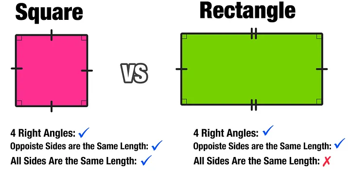

# Liskov Substitution Principle

## The Definition

``` 
if f(x) is a property provable about objects x of type <T>
then f(y) should be true for objects y of type <S>
        where <S> is a subtype of <T>
```

## Explanation
### An objet can be replaced by a sub-object without breaking the program
- as what holds for T-objects holds for S-objects is what must be understood 

## Example


### A Square Breaks Liskov Substitution Principle
- Since Square does not have a Different Height and Width 
- So Not Everything True for Rectangle Is True for Square